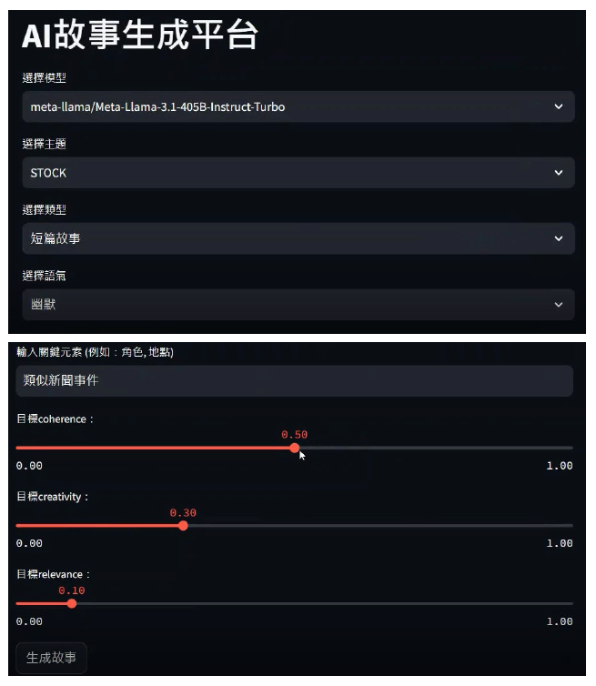
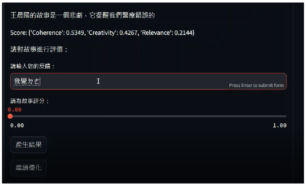

# IR-GenAI_Final_Project - AI-Driven Personalized Storytelling and Content Creation Platform

## 專題說明
本專題致力於開發一個結合 生成式AI 與 自動提示工程（Automatic Prompt Engineering） 的故事創作平台。使用者只需輸入偏好（如主題、語氣、角色等），系統便會根據這些輸入，透過自動化提示優化技術，動態生成具備一致性、創意與個人化的文字內容（例如短篇故事、部落格文章或互動對話）。

系統具備回饋學習機制，不僅能自動評估文本品質，還能根據使用者評分與意見持續優化生成內容。最終目標是提供一個高度互動、個性化且跨模態（文字+圖片）的內容生成體驗。

## 整體流程關鍵技術點
1.RAG + Self-Reflection 應用於 prompt 優化與故事生成
2.多模型語言生成，提升內容的多樣性與準確性
3.使用者回饋與 NLP 分數共同驅動 prompt 再優化
4.結合向量檢索與知識資料庫提升生成內容一致性
5.圖文並茂輸出，創造個性化故事體驗

---

## 技術說明

| Layer            | Technology                                                   |
|------------------|--------------------------------------------------------------|
| Language Model   | Together AI, Hugging Face Transformers, RAG                 |
| Prompt Engineering | Dynamic Prompt Engineering, LangChains                         |
| Backend          | Python (Streamlit-based App)                                 |
| Frontend         | Streamlit                                                    |
| Storage          | JSON-based file storage, session logs in text format         |
| Evaluation       | Cosine Similarity, Type-Token Ratio (TTR), User Feedback      |

---
### 環境設定
- pip install -r requirements.txt
- go to https://www.together.ai/ to get your API key
- create .env file then paste your API key in it.
- E.g. TOGETHER_API_KEY3=1234

### 在終端機執行程式碼
- cd {the folder path of IR_Final.py }
- streamlit run IR_Final.py

### 關於程式碼
- IR_Final: UI、優化提示、主功能（整合所有功能）、使用者回饋、設定等等…

##### 1.使用者偏好介面
##### 2.動態提示工程模組
##### 3.生成式人工智慧整合
##### 4.自動內容評估與回饋迴路
##### 5.輸出視覺化與個人化

- StoryRAG: 使用期中資料庫生成故事。（由 RAG 建立） 

- nlp_sentenceBert: NLP 計算

## 使用者介面

使用 Streamlit 打造互動介面，支援以下功能：  
- 主題、語調、風格、角色等偏好輸入  
- 多模型與 NLP 評分目標選擇  
- 可檢視故事與圖片結果、提供使用者回饋並進一步優化

### 主介面  

### 使用者回饋介面  

## DEMO

1.   
2. 

